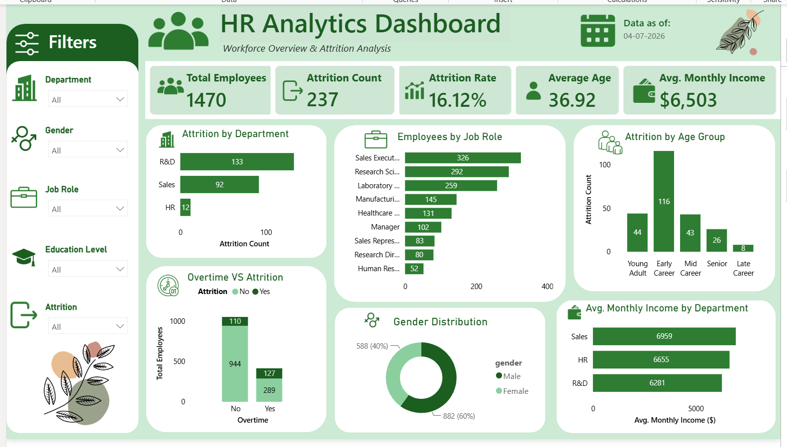
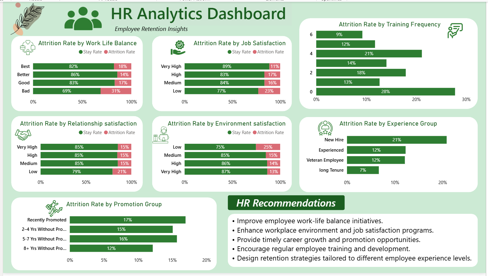

# HR Analytics & Employee Retention Dashboard

An end-to-end HR Analytics project that leverages **Python, PostgreSQL, SQL, and Power BI** to analyze employee attrition, workforce demographics, and organizational performance. The project focuses on uncovering key factors influencing employee retention and presenting actionable business insights through interactive dashboards.

---

## 📌 Project Overview

Employee attrition is one of the major challenges faced by organizations. This project analyzes HR data to identify workforce trends, understand the factors contributing to employee attrition, and support data-driven HR decision-making.

The project covers the complete analytics workflow including:

- Data Cleaning & Preprocessing
- Exploratory Data Analysis (EDA)
- SQL-based Business Analysis
- Interactive Dashboard Development
- HR KPI Reporting

---

## 📊 Dataset

- **Total Employees:** 1,470
- **Processed Dataset:** Included in this repository
- **Domain:** Human Resources

The dataset contains employee information including:

- Demographics
- Department
- Job Role
- Education
- Monthly Income
- Attrition
- Job Satisfaction
- Work-Life Balance
- Overtime
- Performance Rating
- Years at Company
- Business Travel
- and more.

---

## 🛠️ Tech Stack

- Python
- Pandas
- PostgreSQL
- SQL
- Power BI

---

## 📂 Repository Structure

```text
HR-Analytics-Employee-Retention/
│
├── data/
│   └── HR-Employee-Attrition.csv
│   └── processed_hr_data.csv
│
├── notebook/
│   └── employee_attrition_analysis.ipynb
│
├── sql/
│   └── employee_attrition_queries.sql
│
├── dashboard/
│   └── hr_analytics-dashboard.pbix
│
├── images/
│   ├── HR_dashboard1.png
│   └── HR_dashboard2.png
│
└── README.md
```

---

## 🔄 Project Workflow

1. Cleaned and preprocessed HR data using Python.
2. Performed exploratory data analysis to identify workforce trends.
3. Imported the processed dataset into PostgreSQL.
4. Wrote SQL queries to answer HR business questions.
5. Created an interactive Power BI dashboard to visualize employee insights.

---

## 📈 Dashboard Features

The dashboard includes:

- Employee Count
- Attrition Rate
- Average Age
- Average Salary
- Attrition by Department
- Attrition by Job Role
- Attrition by Education Field
- Attrition by Age Group
- Monthly Income Analysis
- Job Satisfaction Analysis
- Overtime Analysis
- Years at Company
- Gender Distribution
- Interactive Filters & Slicers

---

## 🔍 SQL Analysis

Performed SQL analysis to answer business questions such as:

- Which departments have the highest attrition?
- Which job roles experience maximum employee turnover?
- How does overtime impact attrition?
- What is the average monthly income across departments?
- Which education fields have the highest attrition?
- How does job satisfaction relate to employee retention?

---

## 📊 Key Insights

- Identified departments and job roles with higher employee attrition.
- Found strong relationships between overtime and employee turnover.
- Analyzed employee demographics influencing retention.
- Compared salary, education, and experience across departments.
- Built an interactive dashboard for HR decision support.

---

## 📷 Dashboard Preview

### HR Analytics Dashboard




---

## 🚀 Future Improvements

- Employee Attrition Prediction using Machine Learning
- Dashboard Deployment using Power BI Service
- Automated ETL Pipeline
- Real-time HR Analytics Dashboard

---

## 👩‍💻 Author

**Anjali Kumari**

B.Tech, Mechanical Engineering  
Indian Institute of Technology Kanpur

- LinkedIn: www.linkedin.com/in/anjali-kumari-b5581823a
- GitHub: github.com/anjalikumari6246
